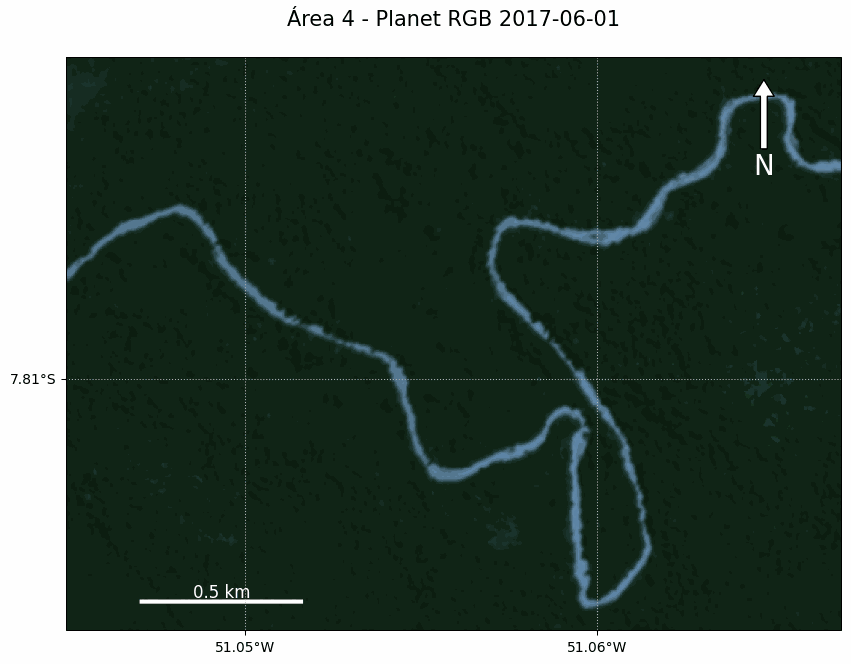

<html lang="pt-br">
<head>
    <meta charset="UTF-8">
    <title>JIC 2023</title>
    <link rel="stylesheet" href="style.css">
</head>
<body>
    

        <header>
            <h1>Avanço do garimpo ilegal na Amazônia</h1>
        </header>
        <section class="area" id="area1">
            <h2>Garimpo por balsa</h2>
            
            <h3>ÁREA 1</h3>
              
            

                <h3>Planet</h3>
                
            

            

                <h3>Sentinel2</h3>
                
            

            

                <h3>Sentinel1</h3>
                
            

             

                <h3>Landsat</h3>
                
            

        </section>
        <section class="area" id="area2">
            <h3>ÁREA 2</h3>
            

                <h3>Planet</h3>
                
            

            

                <h3>Sentinel2</h3>
                
            

            

                <h3>Sentinel1</h3>
                
            

            

                <h3>Landsat</h3>
                
            

         </section>
         
          <h2>Garimpo por Maquinário pesado</h2>
         
         <section class="area" id="area1">
            <h3>ÁREA 3</h3>

            

                <h3>Planet</h3>
                
            

            

                <h3>Sentinel2</h3>
                
            
            
            

                <h3>Sentinel1</h3>
                
            

             

    
                
            

         </section>
        <section class="area" id="area2">
            <h3>Área 4</h3>
          
            

                <h3>Planet</h3>
                
            

             

                <h3>Landsat</h3>
                
            

            

                <h3>Sentinel1</h3>
                
            

            

                <h3>Sentinel2</h3>
                
            

        </section>
    

    
</body>
</html>

