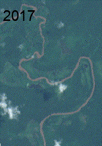
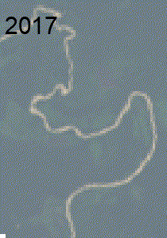
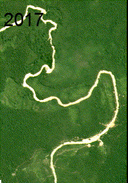
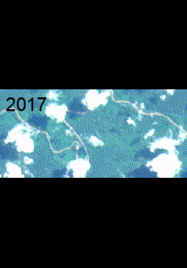
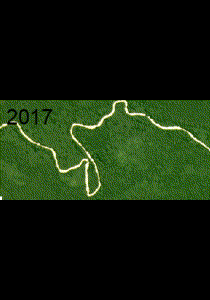
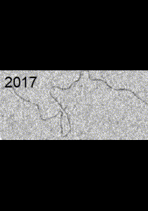

<html lang="pt-br">
<head>
    <meta charset="UTF-8">
    <title>Meu Site Simples</title>
    
</head>
<body>
    <h1>JIC 2023</h1>
    
    

        <h2>AREA 1</h2>
        

            <h3>Sentinel2</h3>
             
        

        

            <h3>Landsat</h3>
            
        

        

            <h3>Planet</h3>
            
        

           

            <h3>Sentinel1</h3>
            
        

    

    

        <h2>AREA 2</h2>
      

            <h3>Sentinel2</h3>
             
        

        

            <h3>Landsat</h3>
            
        

        

            <h3>Planet</h3>
            
        

           

            <h3>Sentinel1</h3>
            
        

    

    
</body>
</html>

